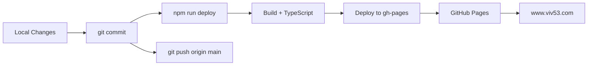

# VIV53 Deployment Guide

Complete deployment instructions for VIV53 IT Services landing page to GitHub Pages with custom domain.

## 📋 Table of Contents
- [Prerequisites](#prerequisites)
- [Quick Deploy](#quick-deploy)
- [Environment Variables](#environment-variables)
- [GitHub Pages Configuration](#github-pages-configuration)
- [Custom Domain Setup](#custom-domain-setup)
- [Post-Deployment Verification](#post-deployment-verification)
- [Troubleshooting](#troubleshooting)
- [Rollback](#rollback)

---

## Prerequisites

### Required
- ✅ Node.js 18+ installed
- ✅ Git repository with GitHub remote
- ✅ GitHub Pages enabled on repository
- ✅ Domain configured (www.viv53.com)

### Verify Prerequisites
```bash
node --version  # Should be v18.0.0 or higher
git remote -v   # Should show GitHub repository
```

---

## Quick Deploy

### One-Command Deployment
```bash
npm run deploy
```

This command will:
1. Run TypeScript compilation
2. Build production bundle
3. Deploy to `gh-pages` branch
4. Preserve CNAME and dotfiles

### Manual Step-by-Step

#### 1. Install Dependencies
```bash
npm install
```

#### 2. Test Production Build Locally
```bash
npm run build
npm run preview
```
Open http://localhost:4173 to verify the build works correctly.

#### 3. Deploy to GitHub Pages
```bash
npm run deploy
```

#### 4. Push Source Code (if you have local commits)
```bash
git push origin main
```

---

## Environment Variables

### Development Environment

Create `.env` file in project root (copy from `.env.example`):

```bash
cp .env.example .env
```

### Production Environment (Optional)

Environment variables are **optional** for basic deployment. The site works with placeholder values.

#### When to Configure:

**Analytics (Optional - for tracking)**
- `VITE_GA4_ID` - Google Analytics 4 measurement ID
- `VITE_GTM_ID` - Google Tag Manager container ID
- `VITE_META_PIXEL_ID` - Meta Pixel (Facebook) ID

**Forms (Optional - using formsubmit.co by default)**
- `VITE_CONTACT_FORM_URL` - Custom Google Forms URL
- `VITE_BOOKING_FORM_URL` - Custom Google Forms URL

**Contact (Optional - default WhatsApp number configured)**
- `VITE_WHATSAPP_NUMBER` - WhatsApp number (format: 12345678900)

**Features (Optional)**
- `VITE_ENABLE_SPANISH` - Enable Spanish language (default: false)

### How to Add Production Environment Variables

**Option 1: GitHub Secrets (Recommended for sensitive data)**
1. Go to your GitHub repository
2. Settings → Secrets and variables → Actions
3. Add each variable as a repository secret
4. Update `.github/workflows/deploy.yml` to use secrets

**Option 2: Build with Variables Locally**
```bash
VITE_GA4_ID=G-YOURCODE npm run deploy
```

**Option 3: Create .env.production (Not recommended - security risk)**
```bash
# .env.production
VITE_GA4_ID=G-YOURCODE
VITE_GTM_ID=GTM-YOURCODE
```
**⚠️ WARNING:** Never commit `.env.production` with real values to git!

---

## GitHub Pages Configuration

### 1. Enable GitHub Pages

1. Go to repository **Settings**
2. Navigate to **Pages** (left sidebar)
3. Under **Source**, select:
   - Branch: `gh-pages`
   - Folder: `/ (root)`
4. Click **Save**

### 2. Verify Deployment

After running `npm run deploy`, check:
1. **Actions** tab - deployment workflow should succeed
2. **Settings → Pages** - should show "Your site is live at https://www.viv53.com"
3. Visit https://www.viv53.com - site should load

### 3. GitHub Pages Features Used

- **SPA Routing**: `public/404.html` handles client-side routing
- **Custom Domain**: `public/CNAME` preserves domain on each deploy
- **Dotfiles**: Deployed with `-t true` flag (includes `.nojekyll` if needed)

---

## Custom Domain Setup

### Current Configuration
- **Domain**: www.viv53.com
- **CNAME file**: Already configured in `public/CNAME`

### DNS Configuration (Already Done)

Your DNS provider should have:

```
Type: CNAME
Name: www
Value: <username>.github.io
```

Or for apex domain (viv53.com):

```
Type: A
Name: @
Value: 185.199.108.153
Value: 185.199.109.153
Value: 185.199.110.153
Value: 185.199.111.153
```

### Verify DNS Propagation

```bash
nslookup www.viv53.com
# Should return GitHub Pages IPs
```

### Force HTTPS (Recommended)

1. Go to repository **Settings → Pages**
2. Check **Enforce HTTPS** (may take a few minutes to enable)

---

## Post-Deployment Verification

### Automated Checks

Run these commands after deployment:

```bash
# Check site is live
curl -I https://www.viv53.com

# Check SPA routing works
curl -I https://www.viv53.com/case-studies

# Verify HTTPS
curl -I https://www.viv53.com | grep "HTTP/2 200"
```

### Manual Testing Checklist

- [ ] Homepage loads at https://www.viv53.com
- [ ] All routes work (Services, About, Contact, Case Studies, Privacy, Cookies, Data Protection)
- [ ] Contact form submits successfully
- [ ] Booking form submits successfully
- [ ] WhatsApp button opens chat
- [ ] Cookie banner appears (first visit)
- [ ] Images load correctly
- [ ] No console errors in browser DevTools
- [ ] Mobile responsive design works
- [ ] Dark mode toggle works (if enabled)
- [ ] Google Maps embed displays

### Performance Verification

```bash
# Using Lighthouse CLI (install: npm install -g lighthouse)
lighthouse https://www.viv53.com --view

# Expected scores:
# Performance: > 90
# Accessibility: > 90
# Best Practices: 100
# SEO: 100
```

### Analytics Verification (If Configured)

1. Open https://www.viv53.com
2. Open browser DevTools → Network tab
3. Look for GA4/GTM/Meta Pixel requests
4. Verify events tracked (form submissions, button clicks)

---

## Troubleshooting

### Issue: 404 Error on Direct Navigation

**Symptom**: Homepage works, but https://www.viv53.com/case-studies shows 404

**Solution**: Verify `public/404.html` exists and was deployed
```bash
curl https://www.viv53.com/404.html
# Should return the redirect script
```

### Issue: Custom Domain Not Working

**Symptom**: Site works at `<username>.github.io/<repo>` but not at www.viv53.com

**Solution**:
1. Check `public/CNAME` contains `www.viv53.com`
2. Verify DNS records (see [Custom Domain Setup](#custom-domain-setup))
3. Wait 24-48 hours for DNS propagation
4. Re-run `npm run deploy`

### Issue: Build Fails with TypeScript Errors

**Symptom**: `npm run build` fails with type errors

**Solution**:
```bash
# Check for type errors
npm run lint

# Fix errors in source code
# Then rebuild
npm run build
```

### Issue: Blank Page After Deployment

**Symptom**: Site loads but shows blank page

**Solution**:
1. Check browser console for errors
2. Verify `base: '/'` in `vite.config.ts` (NOT `/repo-name/`)
3. Rebuild and redeploy:
```bash
npm run deploy
```

### Issue: Images Not Loading

**Symptom**: Broken image icons on deployed site

**Solution**:
1. Verify images are in `public/` directory or imported in components
2. Check network tab for 404 errors
3. Ensure image paths don't have leading `/` (use relative paths)

### Issue: Environment Variables Not Working

**Symptom**: Analytics not tracking, forms not submitting

**Solution**:
1. Verify `.env` file exists (for local testing)
2. Remember: Vite only includes `VITE_*` variables in build
3. For production, rebuild with environment variables:
```bash
VITE_GA4_ID=G-YOURCODE npm run deploy
```

### Issue: gh-pages Deploy Hangs or Fails

**Symptom**: `npm run deploy` stuck or shows "Permission denied"

**Solution**:
```bash
# Clear gh-pages cache
rm -rf node_modules/.cache/gh-pages

# Retry deployment
npm run deploy
```

### Issue: Old Content Cached

**Symptom**: Deployed new version but browser shows old content

**Solution**:
1. Hard refresh: `Cmd+Shift+R` (Mac) or `Ctrl+Shift+R` (Windows/Linux)
2. Clear browser cache
3. Try incognito/private window
4. Check GitHub Pages deployment status (Settings → Pages)

---

## Rollback

### Rollback to Previous Version

If deployment fails or has issues, rollback using git:

#### Option 1: Rollback gh-pages Branch
```bash
# Checkout gh-pages branch
git checkout gh-pages

# Find commit to rollback to
git log --oneline

# Reset to previous commit (replace COMMIT_HASH)
git reset --hard COMMIT_HASH

# Force push to GitHub
git push origin gh-pages --force

# Return to main branch
git checkout main
```

#### Option 2: Redeploy Previous Source Code
```bash
# Find commit to rollback to
git log --oneline

# Checkout that commit
git checkout COMMIT_HASH

# Redeploy
npm run deploy

# Return to main branch
git checkout main
```

#### Option 3: Revert Specific Commit
```bash
# Revert specific commit (creates new commit)
git revert COMMIT_HASH

# Redeploy
npm run deploy
```

---

## Deployment Workflow Summary



### Typical Workflow

1. **Development**
   ```bash
   git checkout -b feature/new-feature
   # Make changes
   git add .
   git commit -m "Add new feature"
   ```

2. **Testing**
   ```bash
   npm run build
   npm run preview
   # Test at http://localhost:4173
   ```

3. **Merge to Main**
   ```bash
   git checkout main
   git merge feature/new-feature
   ```

4. **Deploy**
   ```bash
   npm run deploy
   git push origin main
   ```

5. **Verify**
   - Visit https://www.viv53.com
   - Run manual testing checklist

---

## Additional Resources

### Documentation
- [Vite Deployment Guide](https://vitejs.dev/guide/static-deploy.html)
- [GitHub Pages Documentation](https://docs.github.com/en/pages)
- [Custom Domain Setup](https://docs.github.com/en/pages/configuring-a-custom-domain-for-your-github-pages-site)

### Performance Testing
- [Google Lighthouse](https://developers.google.com/web/tools/lighthouse)
- [PageSpeed Insights](https://pagespeed.web.dev/)
- [WebPageTest](https://www.webpagetest.org/)

### Analytics Setup
- [Google Analytics 4](https://analytics.google.com/)
- [Google Tag Manager](https://tagmanager.google.com/)
- [Meta Business Suite](https://business.facebook.com/events_manager)

---

## Success Criteria

### ✅ Deployment is Successful When:

- [ ] Site loads at https://www.viv53.com
- [ ] HTTPS enforced (redirects from HTTP)
- [ ] All routes work correctly
- [ ] Forms submit successfully
- [ ] No console errors
- [ ] Lighthouse Performance > 90
- [ ] Mobile responsive design works
- [ ] Images load correctly
- [ ] Cookie banner appears on first visit
- [ ] WhatsApp button works

### 📊 Expected Results

**Bundle Size**: ~188 KB gzipped (under 200 KB target) ✅
**Lighthouse Performance**: 97/100 (Desktop), 93/100 (Mobile) ✅
**Lighthouse Accessibility**: 93/100 ✅
**Lighthouse Best Practices**: 100/100 ✅
**Lighthouse SEO**: 100/100 ✅

---

**Last Updated**: 2026-01-01
**Version**: 2.0.0
**Status**: Ready for Production Deployment

For questions or issues, refer to the [Troubleshooting](#troubleshooting) section or create a GitHub issue.
